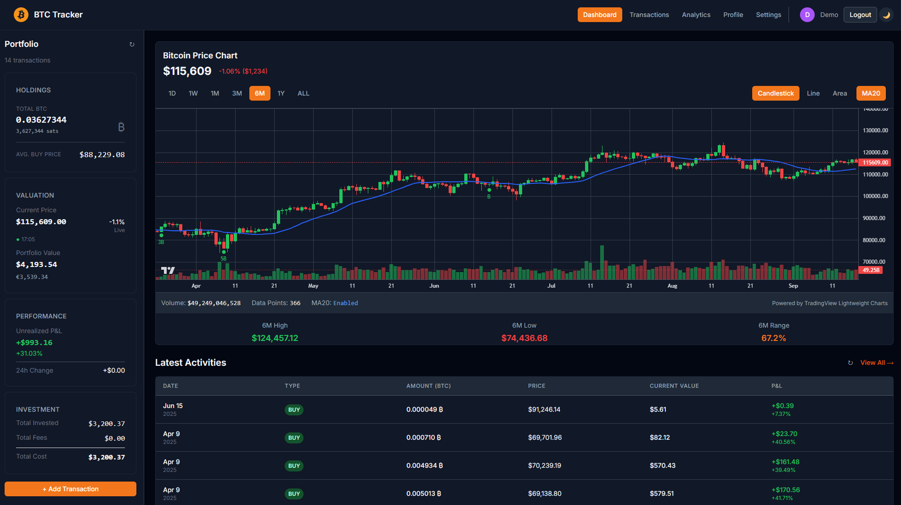
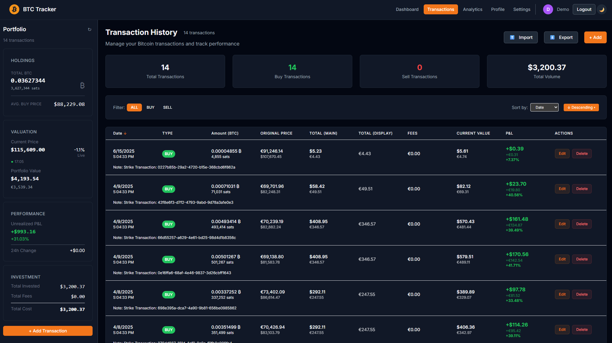
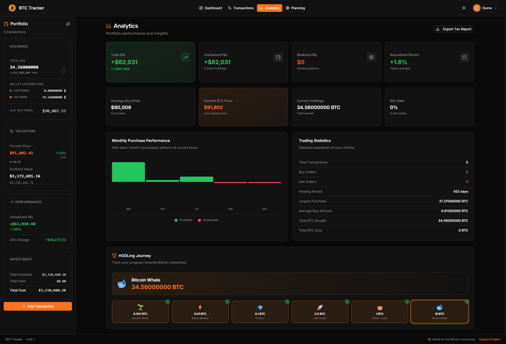
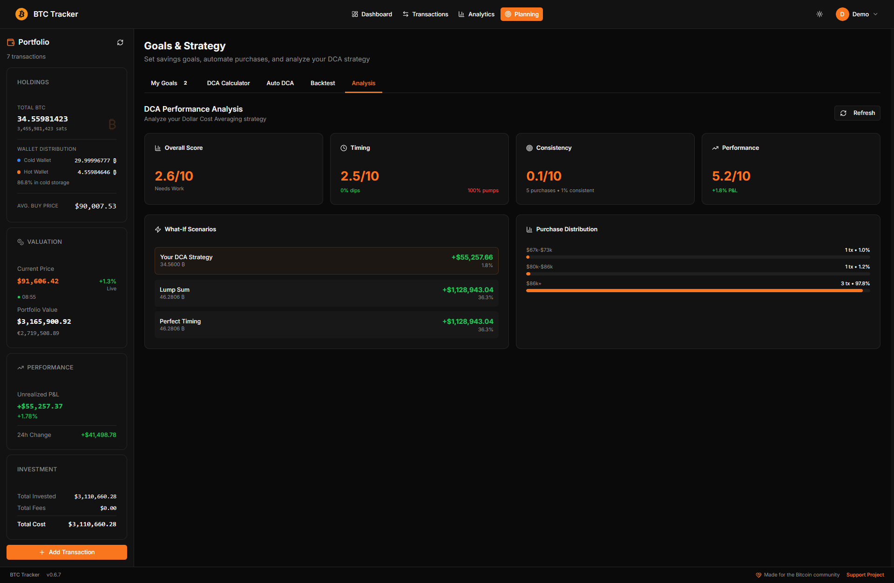
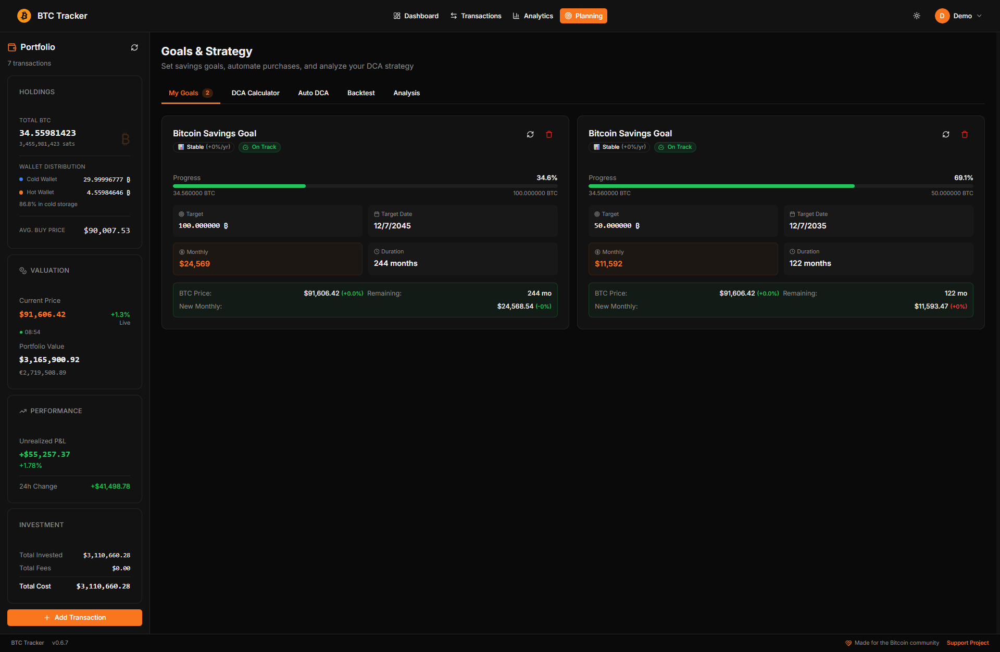
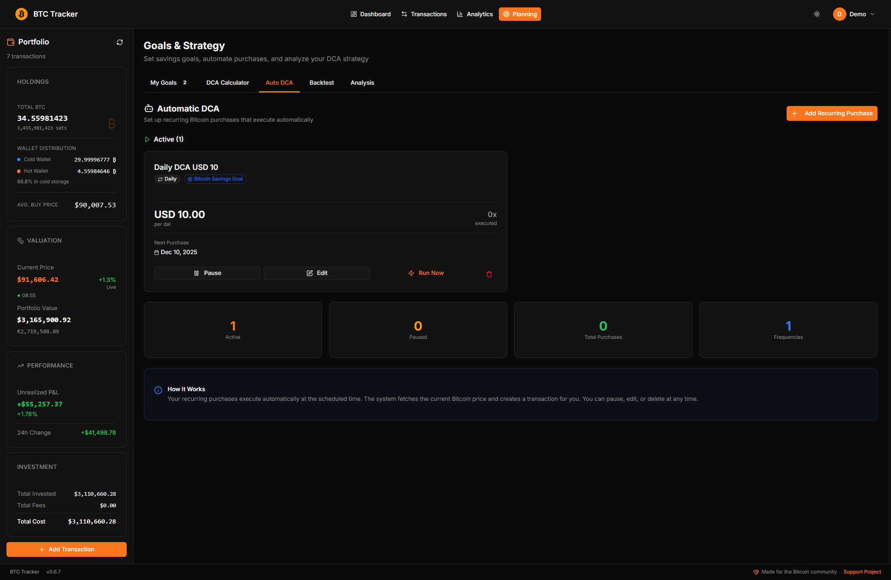
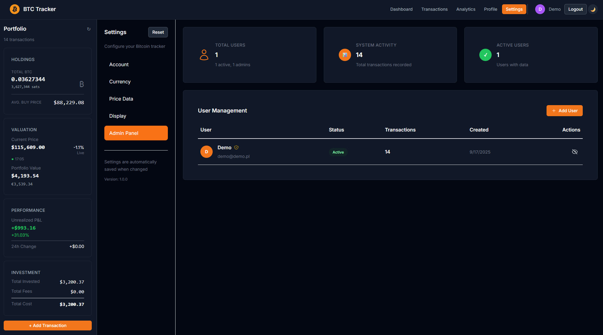
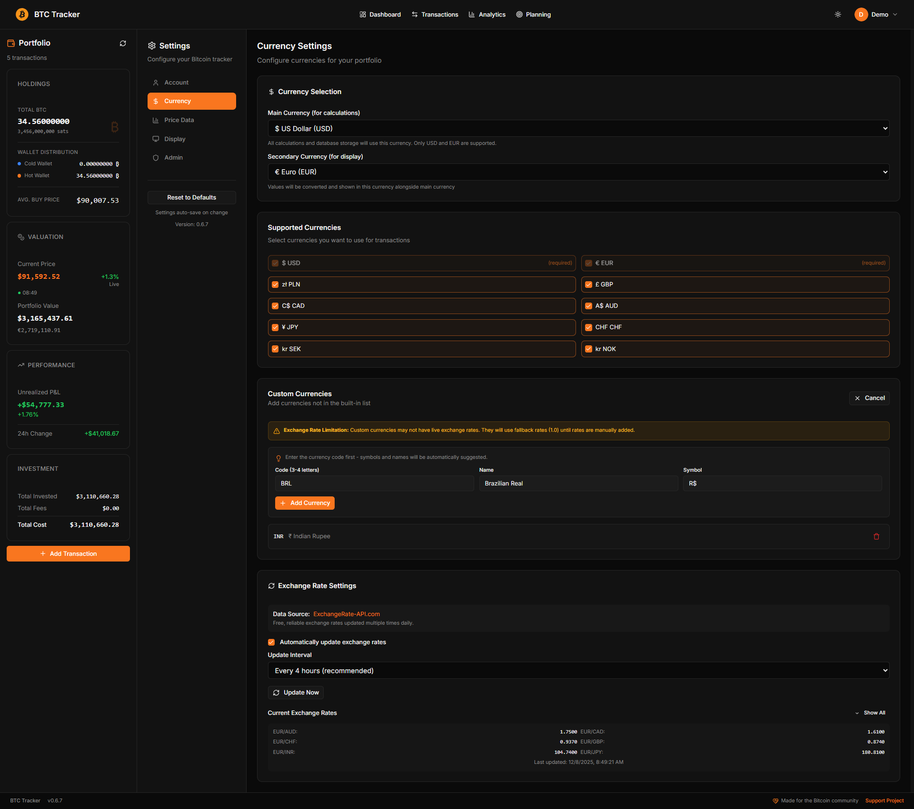

# BTC Tracker


[](https://discord.gg/v2ByAYHA)
[](https://buymeacoffee.com/wilqqthe)
[](lightning:wilqqthe@strike.me)

**Self-hosted Bitcoin portfolio tracker - that's it.**

> If you find BTC Tracker useful, please consider [giving it a star](https://github.com/wilqq-the/BTC-Tracker) ⭐

Track your Bitcoin investments privately on your own PC. Import transactions from exchanges or add them manually. Multi-user support with admin controls. Your data never leaves your server, period.

## Install on Umbrel

[](https://apps.umbrel.com/app/btctracker)

**Special thanks to [@dennysubke](https://github.com/dennysubke) for helping bring BTC Tracker to Umbrel!**


*Install BTC Tracker with one click on your Umbrel home server*

## Features

### Portfolio Tracking
- **Live price updates** - Automatic price fetching with real-time P&L calculations
- **Transaction history** - Buy, sell, and transfer transactions with full history
- **Hot/cold distribution** - Track your storage distribution across wallets
- **Multi-currency support** - USD, EUR, GBP, PLN, or add your own custom currencies

### Analytics & Insights
- **Performance tracking** - See your gains across different timeframes (24h, 7d, 30d, 1y, all-time)
- **DCA analysis** - Understand your dollar-cost averaging performance
- **Interactive charts** - Price charts with your transaction markers
- **Monthly summaries** - Track your accumulation month by month

### Planning Tools
- **Savings goals** - Set BTC targets and track progress
- **DCA calculator** - Plan future purchases with backtesting
- **Recurring transactions** - Auto-log your DCA purchases

### Customizable Dashboard
- **Drag & drop widgets** - Arrange your dashboard your way
- **Show/hide widgets** - Only see what matters to you
- **Multiple widget types** - Chart, portfolio, transactions, goals, DCA analysis, and more

### Privacy & Control
- **100% self-hosted** - Your data never leaves your server
- **Multi-user support** - First user becomes admin, create accounts for family
- **Easy import** - Auto-detect CSV format from Kraken, Binance, Coinbase, Strike
- **Simple backup** - Single SQLite file, easy to backup and restore

## Screenshots


*Main portfolio dashboard with real-time Bitcoin tracking*

<details>
<summary>Transactions - Import and management</summary>


*Transaction management and CSV import from exchanges*
</details>

<details>
<summary>Analytics - Charts and performance</summary>


*Advanced portfolio analytics and performance charts*
</details>

<details>
<summary>DCA Analysis - Performance breakdown</summary>


*DCA performance analysis and statistics*
</details>

<details>
<summary>Goals - Savings targets</summary>


*Set and track your Bitcoin savings goals*
</details>

<details>
<summary>Auto DCA - Recurring transactions</summary>


*Automated recurring transaction scheduling*
</details>

<details>
<summary>Admin Panel - Multi-user management</summary>


*Multi-user management interface (admin only)*
</details>

<details>
<summary>Currencies - Multi-currency support</summary>


*Multi-currency support and custom currency management*
</details>

## Quick Start

**With Docker (recommended):**
```bash
git clone https://github.com/wilqq-the/BTC-Tracker.git
cd BTC-Tracker
cp docker.env.example .env
# Edit .env and add NEXTAUTH_SECRET
docker-compose up -d
```

**Local development:**
```bash
npm install
cp .env.example .env
# Add NEXTAUTH_SECRET to .env
npm exec prisma db push
npm run dev
```

Open `http://localhost:3000` and register the first user (becomes admin automatically).

## How multi-user works

- **First user** = automatic admin
- **Admin panel** in Settings tab (admin users only)
- **Create users** with email/password
- **Each user** sees only their own transactions and portfolio
- **No data mixing** between users

## Admin features

- Create/delete user accounts
- Activate/deactivate users
- View system stats (user count, total transactions)
- Cannot see other users' financial data (privacy protection)

## Importing transactions

1. Export CSV from your exchange (Kraken, Binance, Coinbase, Strike)
2. Go to Transactions tab > Import
3. Drop the CSV file - format detected automatically
4. Review and import

Supports most major exchanges. If yours isn't supported, open an issue with example file.

## Tech stack

- **Frontend**: Next.js, React, TypeScript, shadcn/ui
- **Backend**: Next.js API routes, Prisma ORM
- **Database**: SQLite (single file, easy backups)
- **Deployment**: Docker

## Development

```bash
npm run dev      # Start dev server
npm run build    # Build for production
npm test         # Run tests
npm exec prisma studio # Database GUI
```

## Why I built this?

Existing portfolio trackers either:
- Send your data to third parties
- Don't support multiple users
- Have terrible import systems
- Cost money for basic features
- Require xpub or zpub wallet address

This gives you complete control over your Bitcoin tracking data.

## Requirements

- **Docker** (recommended) or Node.js 18+
- ~100MB disk space for the app
- SQLite database (included, single file)

## Backup & Restore

Your data lives in a single SQLite file. To backup:

```bash
# Docker
docker cp btc-tracker:/app/prisma/dev.db ./backup.db

# Local
cp prisma/dev.db ./backup.db
```

To restore, copy the file back and restart the app.

## Community

- [Discord](https://discord.gg/v2ByAYHA) - Chat with other users and get help
- [GitHub Discussions](https://github.com/wilqq-the/BTC-Tracker/discussions) - Ask questions, share ideas
- [Issue Tracker](https://github.com/wilqq-the/BTC-Tracker/issues) - Report bugs, request features

## Contributing

Found a bug? Want a feature? [Open an issue](https://github.com/wilqq-the/BTC-Tracker/issues).

Want to add support for another exchange? Check the [Parser Development Guide](src/app/api/transactions/import/parsers/PARSER_DEVELOPMENT_GUIDE.md).

## License

MIT - do what you want with it.

---

**Your Bitcoin data belongs to you, not someone else's.**