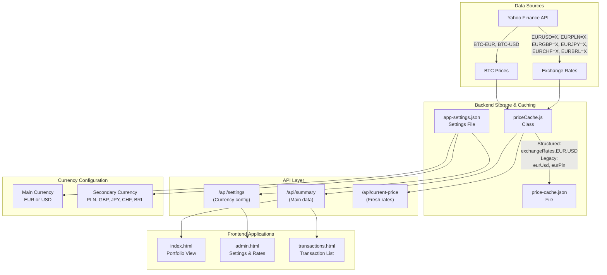

# 🏦 BTC Tracker Currency System Documentation

## 📋 Table of Contents
- [Overview](#overview)
- [System Architecture](#system-architecture)
- [Core Components](#core-components)
- [Currency Support](#currency-support)
- [Data Flow](#data-flow)
- [API Endpoints](#api-endpoints)
- [Frontend Integration](#frontend-integration)
- [Reliability Features](#reliability-features)
- [Performance Optimizations](#performance-optimizations)
- [Monitoring & Debugging](#monitoring--debugging)
- [Configuration](#configuration)
- [Troubleshooting](#troubleshooting)

## 📊 Overview

The BTC Tracker currency system is a **sophisticated multi-layered architecture** designed to provide reliable, real-time currency conversions for Bitcoin portfolio tracking. The system supports multiple base currencies (EUR, USD) and various secondary currencies (PLN, GBP, JPY, CHF, BRL) with automatic fallback mechanisms and intelligent caching.

### Key Features
- ✅ **Real-time exchange rates** from Yahoo Finance
- ✅ **Dual currency display** (main + secondary)
- ✅ **Intelligent fallback** mechanisms
- ✅ **Rate limiting protection**
- ✅ **Cross-currency calculations**
- ✅ **Persistent caching** with auto-refresh

## 🏗️ System Architecture



## 🔧 Core Components

### 1. Data Sources

#### Yahoo Finance API
- **Primary source** for all exchange rate data
- **Endpoints used**:
  - `EURUSD=X` - Euro to US Dollar
  - `EURPLN=X` - Euro to Polish Złoty
  - `EURGBP=X` - Euro to British Pound
  - `EURJPY=X` - Euro to Japanese Yen
  - `EURCHF=X` - Euro to Swiss Franc
  - `EURBRL=X` - Euro to Brazilian Real
- **Rate limiting protection**: Sequential fetching with 200ms delays
- **Reliability**: 5 retry attempts with exponential backoff

### 2. Storage & Caching Layer

#### priceCache.js
**Location**: `src/server/priceCache.js`

Singleton class responsible for:
- Fetching exchange rates from Yahoo Finance
- Managing BTC price data
- Handling cache persistence
- Providing rate conversion methods

**Key Methods**:
```javascript
// Fetch rates with rate limiting protection
async fetchExchangeRatesFromYahoo()

// Get exchange rate between any two currencies
getExchangeRate(fromCurrency, toCurrency)

// Get BTC price in any supported currency
getBTCPrice(currency = 'EUR')

// Update and persist exchange rates
async updateExchangeRates(eurRates, usdRates = null)
```

#### price-cache.json
**Location**: `src/data/price-cache.json`

Persistent storage with **dual format** for backward compatibility:

```json
{
  "priceEUR": 92668.4296875,
  "priceUSD": 105646.5859375,
  "exchangeRates": {
    "EUR": {
      "USD": 1.1396011114120483,
      "PLN": 4.285600185394287,
      "GBP": 0.8425300121307373,
      "JPY": 165.05299377441406,
      "CHF": 0.9363200068473816,
      "BRL": 6.337900161743164
    },
    "USD": {
      "EUR": 0.877500021705777,
      "PLN": 3.760614255705769,
      "GBP": 0.7393201039324906,
      "JPY": 144.8340056196518,
      "CHF": 0.8216208263321306,
      "BRL": 5.561507529498674
    }
  },
  "eurUsd": 1.1396011114120483,
  "eurPln": 4.285600185394287,
  "eurGbp": 0.8425300121307373,
  "eurJpy": 165.05299377441406,
  "eurChf": 0.9363200068473816,
  "eurBrl": 6.337900161743164,
  "timestamp": "2025-06-07T16:06:10.079Z"
}
```

### 3. Configuration Management

#### app-settings.json
**Location**: `src/data/app-settings.json`

User currency preferences:
```json
{
  "mainCurrency": "USD",
  "secondaryCurrency": "PLN",
  "historicalDataYears": "10",
  "historicalDataRefreshHours": "24"
}
```

## 💱 Currency Support

### Supported Currencies

| **Currency** | **Code** | **Type** | **Source** |
|-------------|----------|----------|------------|
| Euro | EUR | Base | Direct from Yahoo Finance |
| US Dollar | USD | Base | Direct from Yahoo Finance |
| Polish Złoty | PLN | Secondary | Direct from Yahoo Finance |
| British Pound | GBP | Secondary | Direct from Yahoo Finance |
| Japanese Yen | JPY | Secondary | Direct from Yahoo Finance |
| Swiss Franc | CHF | Secondary | Direct from Yahoo Finance |
| Brazilian Real | BRL | Secondary | Direct from Yahoo Finance |

### Currency Pair Support Matrix

| **From** | **To** | **Method** | **Example** |
|----------|--------|------------|-------------|
| EUR | USD, PLN, GBP, JPY, CHF, BRL | Direct | `exchangeRates.EUR.USD` |
| USD | EUR | Calculated | `1 / eurUsd` |
| USD | PLN, GBP, JPY, CHF, BRL | Cross-rate | `eurPln / eurUsd` |
| Any | Any | Cross-currency | Via EUR or USD base |

## 🔄 Data Flow

### Exchange Rate Fetching Process

1. **Sequential API Calls** (prevents rate limiting)
   ```javascript
   for (let i = 0; i < essentialPairs.length; i++) {
     if (i > 0) {
       await new Promise(resolve => setTimeout(resolve, 200)); // 200ms delay
     }
     const data = await this.fetchYahooFinanceData(pair, startDate, endDate);
   }
   ```

2. **Dual Storage Format**
   - **Structured**: `exchangeRates.EUR.USD`
   - **Legacy**: `eurUsd` (for backward compatibility)

3. **Fallback Mechanisms**
   - Default values when API fails
   - Cached rates when fresh data unavailable
   - Legacy property population from structured data

### Rate Calculation Hierarchy

1. **Direct Rates** (highest priority)
   ```javascript
   if (data.eurUsd && data.eurUsd > 0) {
     rate = data.eurUsd;
     status = 'available';
   }
   ```

2. **Calculated Rates**
   ```javascript
   // USD to PLN via EUR
   if (data.eurPln && data.eurUsd) {
     rate = data.eurPln / data.eurUsd;
     status = 'calculated';
   }
   ```

3. **Cross-Currency Conversion**
   ```javascript
   // Any currency via EUR base
   if (exchangeRates.EUR[fromCurrency] && exchangeRates.EUR[toCurrency]) {
     const fromToEUR = 1 / exchangeRates.EUR[fromCurrency];
     const eurToTarget = exchangeRates.EUR[toCurrency];
     return fromToEUR * eurToTarget;
   }
   ```

4. **Fallback Defaults**
   ```javascript
   const exchangeRates = {
     EUR: { USD: 1.1, PLN: 4.5, GBP: 0.85, JPY: 160, CHF: 0.95, BRL: 6.34 },
     USD: { EUR: 0.9, PLN: 4.0, GBP: 0.75, JPY: 145, CHF: 0.85, BRL: 5.76 }
   };
   ```

## 🌐 API Endpoints

### `/api/summary`
**Primary data endpoint for portfolio information**

**Parameters**:
- `priceOnly=true` - Returns only price and exchange rate data
- `fresh=true` - Forces fresh data fetch

**Response**:
```json
{
  "priceEUR": 92668.43,
  "priceUSD": 105646.59,
  "eurUsd": 1.1396,
  "eurPln": 4.2856,
  "eurGbp": 0.8425,
  "mainCurrency": "USD",
  "secondaryCurrency": "PLN",
  "exchangeRates": {
    "EUR": { "USD": 1.1396, "PLN": 4.2856 },
    "USD": { "EUR": 0.8775, "PLN": 3.7606 }
  }
}
```

### `/api/settings`
**Currency configuration management**

**GET Response**:
```json
{
  "mainCurrency": "USD",
  "secondaryCurrency": "PLN",
  "historicalDataYears": "10"
}
```

**PUT Request**:
```json
{
  "mainCurrency": "EUR",
  "secondaryCurrency": "BRL"
}
```

### `/api/current-price`
**Real-time BTC price and exchange rates**

**Parameters**:
- `fresh=true` - Forces fresh Yahoo Finance data

**Response**:
```json
{
  "priceEUR": 92668.43,
  "priceUSD": 105646.59,
  "eurUsd": 1.1396,
  "eurPln": 4.2856,
  "timestamp": "2025-06-07T16:06:10.079Z",
  "source": "Yahoo Finance"
}
```

## 🎯 Frontend Integration

### Currency Display Logic

#### Main Portfolio View (index.html)
```javascript
// Priority: Global settings > Server data
const mainCurrency = window.currentMainCurrency || 'EUR';
const secondaryCurrency = window.currentSecondaryCurrency || 'USD';

// Calculate secondary rate
let secondaryRate = 1.0;
if (mainCurrency !== secondaryCurrency) {
  if (mainCurrency === 'EUR') {
    const directRateKey = `eur${secondaryCurrency.toLowerCase()}`;
    secondaryRate = priceData[directRateKey] || 1.0;
  } else if (mainCurrency === 'USD') {
    if (secondaryCurrency === 'EUR') {
      secondaryRate = 1 / (priceData.eurUsd || 1.0);
    } else {
      const eurToSecondary = priceData[`eur${secondaryCurrency.toLowerCase()}`];
      const eurToUsd = priceData.eurUsd;
      secondaryRate = eurToSecondary / eurToUsd;
    }
  }
}
```

#### Admin Panel (admin.html)
```javascript
// Rate validation and display
function getRateInfo(data, mainCurrency, secondaryCurrency) {
  if (mainCurrency === 'EUR') {
    switch(secondaryCurrency) {
      case 'USD':
        if (data.eurUsd && data.eurUsd > 0) {
          return { rate: data.eurUsd.toFixed(4), status: 'available', statusText: 'Direct' };
        }
        break;
      case 'PLN':
        if (data.eurPln && data.eurPln > 0) {
          return { rate: data.eurPln.toFixed(4), status: 'available', statusText: 'Direct' };
        }
        break;
    }
  } else if (mainCurrency === 'USD') {
    switch(secondaryCurrency) {
      case 'EUR':
        if (data.eurUsd && data.eurUsd > 0) {
          const rate = 1 / data.eurUsd;
          return { rate: rate.toFixed(4), status: 'calculated', statusText: 'Calculated' };
        }
        break;
    }
  }
}
```

### Browser Caching Strategy

```javascript
// 24-hour cache with expiration
function setCachedRates(rates) {
  const cacheData = {
    rates: rates,
    timestamp: Date.now(),
    expires: Date.now() + (24 * 60 * 60 * 1000) // 24 hours
  };
  localStorage.setItem('btc_tracker_exchange_rates', JSON.stringify(cacheData));
}

function getCachedRate(mainCurrency, secondaryCurrency) {
  const cached = getCachedRates();
  if (!cached.rates || Date.now() > cached.expires) {
    return null;
  }
  return cached.rates[`${mainCurrency}_${secondaryCurrency}`];
}
```

## 🛡️ Reliability Features

### Error Handling & Fallbacks

#### Retry Logic with Exponential Backoff
```javascript
async function loadExchangeRates(retryCount = 0) {
  const maxRetries = 5;
  
  try {
    const data = await fetch('/api/summary?priceOnly=true');
    // Process successful response
  } catch (error) {
    if (retryCount < maxRetries) {
      const delay = Math.min(2000 * Math.pow(1.5, retryCount), 10000);
      setTimeout(() => loadExchangeRates(retryCount + 1), delay);
    }
  }
}
```

#### Graceful Degradation
```javascript
// Fallback hierarchy
this.cache.eurUsd = this.cache.eurUsd || 
                    this.cache.exchangeRates?.EUR?.USD || 
                    1.1; // Final fallback
```

#### Rate Limiting Protection
```javascript
// Sequential fetching with delays
for (let i = 0; i < essentialPairs.length; i++) {
  if (i > 0) {
    await new Promise(resolve => setTimeout(resolve, 200)); // 200ms delay
  }
  // Fetch currency pair
}
```

### Validation & Error Detection

```javascript
// Currency pair validation
async function validateCurrencyPair(mainCurrency, secondaryCurrency) {
  const data = await fetch('/api/summary?priceOnly=true');
  const rateInfo = getRateInfo(data, mainCurrency, secondaryCurrency);
  
  return {
    isValid: rateInfo.status !== 'unavailable',
    message: `Currency pair ${mainCurrency}/${secondaryCurrency} status: ${rateInfo.status}`,
    warning: rateInfo.status === 'calculated' ? 'Calculated rate may be less accurate' : null
  };
}
```

## 🚀 Performance Optimizations

### Caching Strategy

#### Multi-Level Caching
1. **Memory Cache**: Active rates in `priceCache` singleton
2. **Disk Persistence**: `price-cache.json` for app restarts
3. **Browser Storage**: Frontend caching for responsive UI

#### Smart Cache Invalidation
```javascript
// Invalidate cache only when necessary
if (mainCurrencyChanged || secondaryCurrencyChanged) {
  summaryCache.invalidateCache();
  await priceCache.clearCache();
  
  // Force fresh rate fetch
  setTimeout(async () => {
    await priceCache.updatePrices();
  }, 100);
}
```

### Data Efficiency

#### Minimal API Calls
- Only essential currency pairs fetched
- Cross-rates calculated locally
- Intelligent retry scheduling

#### Optimized Data Structure
```javascript
// Dual format for performance and compatibility
{
  // Fast structured access
  "exchangeRates": { "EUR": { "USD": 1.1396 } },
  
  // Legacy direct access
  "eurUsd": 1.1396
}
```

## 🔍 Monitoring & Debugging

### Logging System

#### Production Logging
```javascript
logger.info(`[priceCache] Exchange rate fetch summary - Success: 6/6, Failed: 0`);
logger.debug(`[priceCache] Final EUR exchange rates - USD: 1.1396, PLN: 4.2856`);
logger.warn(`[priceCache] Using fallback rate for EURJPY=X - received empty data`);
```

#### Debug Functions
```javascript
// Real-time rate inspection
window.debugCurrencyRates = async function() {
  console.log('=== BTC Tracker Currency Rate Debug ===');
  const data = await fetch('/api/summary?priceOnly=true&t=' + Date.now());
  console.log('Exchange rates:', data.eurUsd, data.eurPln, data.eurGbp);
  console.log('Available rates:', {
    eurUsd: !!data.eurUsd,
    eurPln: !!data.eurPln,
    eurBrl: !!data.eurBrl
  });
};
```

### Rate Validation

#### Admin Panel Validation
```javascript
function showRateValidation(rateInfo, mainCurrency, secondaryCurrency) {
  if (rateInfo.status === 'available') {
    showSuccess(`Exchange rate available from Yahoo Finance`);
  } else if (rateInfo.status === 'calculated') {
    showWarning(`Exchange rate calculated from EUR base rates`);
  } else {
    showError(`Exchange rate not available for ${mainCurrency}/${secondaryCurrency}`);
  }
}
```

## ⚙️ Configuration

### Environment Setup

#### Required Dependencies
```json
{
  "axios": "^1.6.0",
  "fs": "built-in",
  "path": "built-in"
}
```

#### File Structure
```
src/
├── server/
│   ├── priceCache.js          # Main cache management
│   └── services/
│       └── currency-converter.js  # Conversion utilities
├── data/
│   ├── price-cache.json       # Persistent cache
│   └── app-settings.json      # User preferences
└── public/
    ├── index.html             # Portfolio view
    ├── admin.html             # Settings panel
    └── transactions.html      # Transaction list
```

### Default Settings

#### Fallback Exchange Rates
```javascript
const defaultRates = {
  EUR: { USD: 1.1, PLN: 4.5, GBP: 0.85, JPY: 160, CHF: 0.95, BRL: 6.34 },
  USD: { EUR: 0.9, PLN: 4.0, GBP: 0.75, JPY: 145, CHF: 0.85, BRL: 5.76 }
};
```

#### Cache Settings
- **Refresh interval**: Every 3 seconds for real-time updates
- **Cache expiration**: 24 hours for browser storage
- **Retry timeout**: 10 seconds per attempt
- **Max retries**: 5 attempts with exponential backoff

## 🔧 Troubleshooting

### Common Issues

#### 1. Exchange Rates Showing as `undefined`

**Symptoms**:
```
EUR rates - USD: 1.1396, PLN: undefined, GBP: undefined
```

**Causes**:
- Yahoo Finance rate limiting
- Market hours (forex markets closed)
- Network connectivity issues

**Solutions**:
1. Wait 2-3 minutes for automatic retry
2. Check browser console for detailed errors
3. Use debug function: `debugCurrencyRates()`
4. Verify internet connection

#### 2. Currency Settings Not Updating

**Symptoms**:
- Changed currency in admin panel but portfolio still shows old currency

**Solutions**:
1. Hard refresh browser (Ctrl+F5)
2. Clear browser cache
3. Check `/api/settings` endpoint response
4. Verify `app-settings.json` file updates

#### 3. Rate Calculation Errors

**Symptoms**:
- Incorrect exchange rates or NaN values

**Solutions**:
1. Check `price-cache.json` for valid data
2. Verify both structured and legacy formats
3. Clear cache: `priceCache.clearCache()`
4. Force fresh data fetch

### Debug Commands

#### Browser Console
```javascript
// Check current rates
debugCurrencyRates();

// Force cache refresh
fetch('/api/summary?fresh=true&priceOnly=true')
  .then(r => r.json())
  .then(console.log);

// Check browser cache
JSON.parse(localStorage.getItem('btc_tracker_exchange_rates'));
```

#### Server Logs
```bash
# Monitor real-time logs
tail -f logs/app.log | grep -E "(priceCache|CURRENCY)"

# Check cache file
cat src/data/price-cache.json | jq '.exchangeRates'
```

### Performance Monitoring

#### Key Metrics
- **API response times**: < 2 seconds
- **Cache hit ratio**: > 90%
- **Error rate**: < 5%
- **Rate fetch success**: > 95%

#### Health Checks
```javascript
// Verify system health
const health = {
  cacheAge: Date.now() - new Date(cache.timestamp).getTime(),
  ratesAvailable: Object.keys(cache.exchangeRates.EUR).length,
  lastUpdate: cache.timestamp,
  apiErrors: errorCount
};
```

---

## 📚 Additional Resources

- **Yahoo Finance API**: [https://finance.yahoo.com](https://finance.yahoo.com)
- **Currency Codes**: [ISO 4217 Standard](https://en.wikipedia.org/wiki/ISO_4217)
- **Forex Market Hours**: [Trading Sessions Guide](https://www.investopedia.com/articles/forex/11/why-trade-forex.asp)

---

*Last Updated: December 2024*
*Version: 0.5.2* 